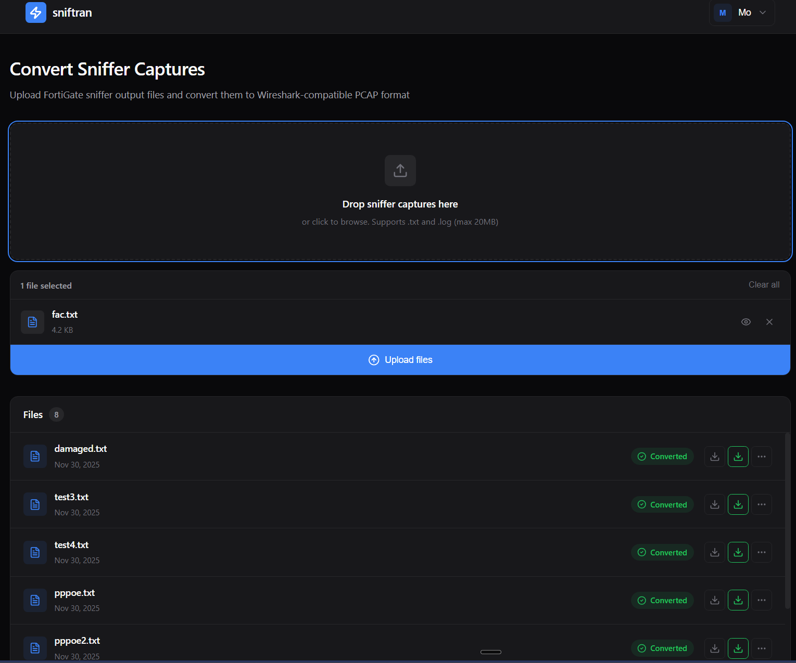

# FortiGate Sniffer to PCAP Converter

A web application that converts FortiGate network sniffer output files to Wireshark-compatible PCAPNG format.



## Features

- User authentication (signup/login with JWT)
- Upload FortiGate sniffer text files
- Convert to PCAPNG format
- Download original or converted files
- Manage conversion history

## Security Features

- Strong password requirements (12+ chars, mixed case, numbers)
- Rate limiting on authentication endpoints
- Account lockout after failed login attempts
- Secure cookie configuration
- Security headers (CSP, X-Frame-Options, HSTS)
- File type validation and filename sanitization
- Audit logging for security events

## Tech Stack

- **Backend:** FastAPI, SQLModel, SQLite, JWT authentication, slowapi
- **Frontend:** React 19, Vite, React Router
- **Conversion:** Custom sniftran library (parser → assembler → PCAPNG writer)

## Quick Start

### Prerequisites

- Python 3.10+
- Node.js 18+
- Or Docker

### Docker (Recommended)

The Docker setup uses a multi-stage build that:
- Builds the React frontend with Node.js
- Creates a lightweight Python Alpine image with the compiled frontend
- Runs as a non-root user for security
- Persists data in a Docker volume

#### Quick Start with Docker

```bash
# Generate a secure secret key
SECRET_KEY=$(python -c "import secrets; print(secrets.token_urlsafe(32))")

# Run with docker-compose
SECRET_KEY=$SECRET_KEY docker-compose up -d

# Access at http://localhost:8000
```

#### Using an Environment File

Create a `.env` file in the project root:

```bash
# .env
SECRET_KEY=your-secure-secret-key-at-least-32-characters
```

Then run:

```bash
docker-compose up -d
```

> **Note:** The default `docker-compose.yml` uses `ENVIRONMENT=development` which allows HTTP access. For production with HTTPS, see [Production Deployment with SSL](#production-deployment-with-ssl).

#### Docker Commands Reference

```bash
# Build and start in detached mode
docker-compose up -d --build

# View logs
docker-compose logs -f

# Stop the container
docker-compose down

# Stop and remove volumes (WARNING: deletes database)
docker-compose down -v

# Rebuild without cache
docker-compose build --no-cache

# Check container health
docker ps
docker inspect sniffer2pcap --format='{{.State.Health.Status}}'
```

#### Docker Configuration Details

The container exposes port 8000 and includes:
- **Health check:** Automatic container health monitoring
- **Data persistence:** SQLite database stored in a named volume (`app-data`)
- **Auto-restart:** Container restarts unless explicitly stopped
- **Security:** Runs as non-root user with minimal Alpine base image

#### Deploying with Portainer

[Portainer](https://www.portainer.io/) provides a web-based UI for managing Docker containers. Here's how to deploy this application using Portainer:

**Option 1: Using Git Repository (Recommended)**

> **Note:** The Stack "Web editor" method won't work because Portainer needs access to the Dockerfile for building. Use the Git Repository method instead.

1. Go to **Stacks** → **Add stack**
2. Name your stack (e.g., `sniffer2pcap`)
3. Select **Repository**
4. Configure:
   - **Repository URL:** `https://github.com/MoAl78741/FortiGate-sniffer-to-PCap-in-FastAPI`
   - **Repository reference:** `refs/heads/main`
   - **Compose path:** `docker-compose.yml`
5. Under **Environment variables**, add:
   - `SECRET_KEY`: Your secure secret key (min 32 characters)
6. Optionally enable **Automatic updates** to pull changes automatically
7. Click **Deploy the stack**

**Option 2: Using a Pre-built Image**

If you've built and pushed the image to a registry:

```bash
# Build and push locally first
docker build -t yourusername/sniffer2pcap:latest .
docker push yourusername/sniffer2pcap:latest
```

Then in Portainer:

1. Go to **Stacks** → **Add stack**
2. Choose **Web editor** and paste:

```yaml
services:
  fastapi-app:
    container_name: sniffer2pcap
    image: yourusername/sniffer2pcap:latest
    ports:
      - "8000:8000"
    environment:
      SECRET_KEY: ${SECRET_KEY}
      ENVIRONMENT: "production"
      DEBUG: "false"
      DATABASE_URL: "sqlite:////app/data/database.db"
    volumes:
      - app-data:/app/data
    restart: unless-stopped

volumes:
  app-data:
```

3. Add `SECRET_KEY` environment variable
4. Click **Deploy the stack**

**Monitoring in Portainer**

Once deployed, you can:
- View container logs under **Containers** → **sniffer2pcap** → **Logs**
- Monitor resource usage in the **Stats** tab
- Access the container console via **Console**
- Check health status in the container details

#### Production Deployment with SSL

For production with HTTPS, use `docker-compose.prod.yml` which includes Traefik as a reverse proxy with automatic Let's Encrypt SSL certificates.

**Prerequisites:**
- A domain name pointing to your server
- Ports 80 and 443 open

**Setup:**

1. Create a `.env` file:

```bash
SECRET_KEY=your-secure-secret-key-at-least-32-characters
DOMAIN=sniffer.yourdomain.com
ACME_EMAIL=your@email.com
```

2. Deploy:

```bash
docker-compose -f docker-compose.prod.yml up -d
```

**What's included:**
- Traefik reverse proxy with automatic HTTPS
- HTTP to HTTPS redirect
- Let's Encrypt certificate auto-renewal
- Secure cookies (`ENVIRONMENT=production`)
- App not directly exposed (only through Traefik)

**For Portainer:** Use the Git Repository method with:
- **Compose path:** `docker-compose.prod.yml`
- **Environment variables:** `SECRET_KEY`, `DOMAIN`, `ACME_EMAIL`

### Manual Installation

```bash
# Clone repository
git clone <repository-url>
cd sniffer_to_pcap_fastapi

# Backend setup
python -m venv .venv
.venv\Scripts\activate  # Windows
# source .venv/bin/activate  # Linux/Mac
pip install -r requirements.txt

# Configure environment
cp .env.example .env
# Edit .env and set a secure SECRET_KEY (minimum 32 characters)

# Frontend setup
cd frontend
npm install
npm run build
cd ..
```

### Running

```bash
# Start server
uvicorn fastapi_app.main:app --reload

# Access at http://localhost:8000
```

### Development Mode

Run backend and frontend separately for hot reload:

```bash
# Terminal 1: Backend
uvicorn fastapi_app.main:app --reload

# Terminal 2: Frontend (with proxy to backend)
cd frontend
npm run dev

# Access at http://localhost:5173
```

## API Documentation

Once running, visit:
- Swagger UI: http://localhost:8000/docs
- ReDoc: http://localhost:8000/redoc

> **Note:** API documentation endpoints are disabled in production mode for security.

## API Examples

### Authentication

#### Create Account

```bash
curl -X POST http://localhost:8000/signup \
  -H "Content-Type: application/json" \
  -d '{
    "email": "user@example.com",
    "password": "SecurePass123!",
    "first_name": "John"
  }'
```

Response:
```json
{
  "email": "user@example.com",
  "first_name": "John",
  "id": 1
}
```

#### Login (Get Access Token)

```bash
curl -X POST http://localhost:8000/token \
  -H "Content-Type: application/x-www-form-urlencoded" \
  -d "username=user@example.com&password=SecurePass123!"
```

Response:
```json
{
  "access_token": "eyJhbGciOiJIUzI1NiIsInR5cCI6IkpXVCJ9...",
  "token_type": "bearer"
}
```

### File Operations

All file operations require authentication. Include the token in the Authorization header:

```bash
TOKEN="your-access-token-here"
```

#### Upload Sniffer File

```bash
curl -X POST http://localhost:8000/upload \
  -H "Authorization: Bearer $TOKEN" \
  -F "files=@sniffer_output.txt"
```

Response:
```json
[
  {
    "id": 1,
    "content": "sniffer_output.txt",
    "date_created": "2024-01-15T10:30:00",
    "user_id": 1,
    "has_converted_data": false
  }
]
```

#### List All Conversions

```bash
curl -X GET http://localhost:8000/conversions \
  -H "Authorization: Bearer $TOKEN"
```

Response:
```json
[
  {
    "id": 1,
    "content": "sniffer_output.txt",
    "date_created": "2024-01-15T10:30:00",
    "user_id": 1,
    "has_converted_data": true
  }
]
```

#### Convert File to PCAP

```bash
curl -X POST http://localhost:8000/convert/1 \
  -H "Authorization: Bearer $TOKEN"
```

Response:
```json
{
  "message": "Converted 150 packets to PCAP successfully"
}
```

#### Download Converted PCAP

```bash
curl -X GET http://localhost:8000/conversions/1/download/pcap \
  -H "Authorization: Bearer $TOKEN" \
  -o output.pcapng
```

#### Download Original File

```bash
curl -X GET http://localhost:8000/conversions/1/download/original \
  -H "Authorization: Bearer $TOKEN" \
  -o original.txt
```

#### Rename Conversion

```bash
curl -X PUT http://localhost:8000/conversions/1 \
  -H "Authorization: Bearer $TOKEN" \
  -H "Content-Type: application/json" \
  -d '{"new_name": "renamed_file.txt"}'
```

Response:
```json
{
  "message": "Renamed successfully"
}
```

#### Delete Conversion

```bash
curl -X DELETE http://localhost:8000/conversions/1 \
  -H "Authorization: Bearer $TOKEN"
```

Response:
```json
{
  "message": "Deleted successfully"
}
```

### Rate Limits

| Endpoint | Limit |
|----------|-------|
| `POST /token` | 5 requests/minute |
| `POST /signup` | 3 requests/hour |

### Error Responses

Authentication errors return 401:
```json
{
  "detail": "Incorrect username or password"
}
```

Rate limit exceeded returns 429:
```json
{
  "detail": "Account temporarily locked due to too many failed attempts. Try again later."
}
```

## Usage

1. Create an account at `/signup`
2. Login at `/login`
3. Upload FortiGate sniffer files from the dashboard
4. Click "Convert" to generate PCAPNG
5. Download the converted file for use in Wireshark

## Project Structure

```
├── fastapi_app/
│   ├── core/           # Config, database, security, logging
│   ├── models/         # SQLModel ORM models
│   ├── schemas/        # Pydantic validation schemas
│   ├── routers/        # API endpoints (with rate limiting)
│   ├── services/       # Conversion business logic
│   └── sniftran/       # Sniffer to PCAP conversion library
├── frontend/
│   └── src/
│       ├── context/    # React auth context
│       ├── pages/      # Login, Signup, Dashboard
│       └── components/ # Reusable UI components
├── Dockerfile              # Multi-stage Docker build
├── docker-compose.yml      # Development Docker config (HTTP)
├── docker-compose.prod.yml # Production config with Traefik SSL
├── .env.example            # Environment configuration template
└── requirements.txt
```

## Environment Variables

| Variable | Description | Default |
|----------|-------------|---------|
| `SECRET_KEY` | JWT signing key (min 32 chars) | Required |
| `DATABASE_KEY` | SQLCipher encryption key (32+ chars) | Optional |
| `ENVIRONMENT` | "development" (HTTP) or "production" (HTTPS only) | development |
| `DEBUG` | Enable debug mode | false |
| `DATABASE_URL` | Database connection string | sqlite:///./database.db |
| `DOMAIN` | Domain for SSL (prod only) | Required for prod |
| `ACME_EMAIL` | Email for Let's Encrypt (prod only) | Required for prod |

## Data-at-Rest Encryption

This application supports SQLCipher for encrypting the SQLite database at rest using AES-256 encryption.

### Enabling Database Encryption

1. Generate a secure encryption key:

```bash
python -c "import secrets; print(secrets.token_urlsafe(32))"
```

2. Add the key to your `.env` file or environment:

```bash
DATABASE_KEY=your-generated-key-here
```

3. Deploy or restart the application. The database will be created encrypted.

### Important Notes

- **Key Security:** Store the `DATABASE_KEY` securely. If lost, the database is unrecoverable.
- **New Deployments:** Encryption works automatically for new databases.
- **Existing Databases:** Unencrypted databases cannot be opened with SQLCipher. You must export data and reimport, or start fresh.
- **Optional:** If `DATABASE_KEY` is not set, the database remains unencrypted (standard SQLite).

### Host-Level Encryption (Optional)

For additional security, you can encrypt the Docker volume at the host level:

**Linux (LUKS):**
```bash
# Create encrypted partition
cryptsetup luksFormat /dev/sdX
cryptsetup open /dev/sdX encrypted_volume
mkfs.ext4 /dev/mapper/encrypted_volume

# Mount and use for Docker volumes
mount /dev/mapper/encrypted_volume /mnt/encrypted
```

**ESXi/vSphere:**
- Enable VM encryption in vCenter
- Uses vCenter key management
- Transparent to guest OS

## License

MIT
